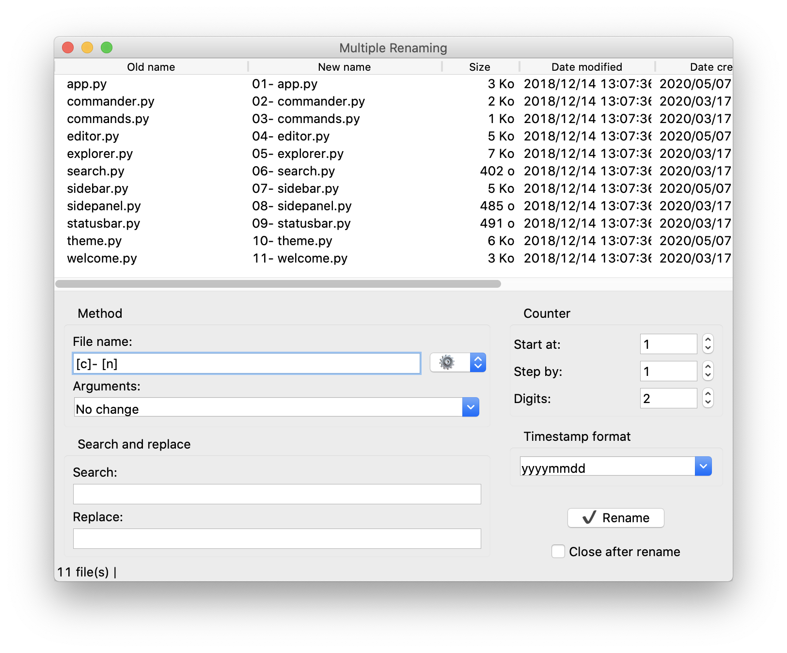

# Multiple Renaming

<p align="center">
    <a href="https://github.com/vincenthouillon/multiple-renaming/issues"></a>
    
    
</p>

## File renaming utility.

Use "Multiple Renaming" to change the names of many files at once. You can replace the file name, add the date, number a series of files, etc. with an immediate overview before applying the changes.

Multilingual support :fr: :gb:



## Downloads:

- [Download for Windows](https://github.com/vincenthouillon/multiple-renaming/releases/download/V1.2/Multiple.Renaming-1.2-amd64.msi)
- [Download for MacOS](https://github.com/vincenthouillon/multiple-renaming/releases/download/V1.2/Multiple.Renaming-1.2-macOS.zip)

## or Getting start

### Required

- Python >= 3.6

### Platforms

Program tested on Windows 10 and macOS Catalina with the following Python versions:

- Python 3.7.4
- Python 3.8.2

### Requirements

No need for requirements, this program only uses the standard Python3 library.

## Usage

Clone the repo and cd into the directory

```bash
git clone https://github.com/vincenthouillon/multiple-renaming.git
cd multiple-renaming
```

Run the app

```bash
python3 multiple_renaming.py
```
